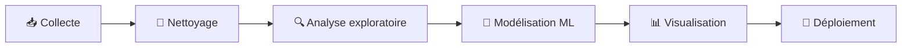

<p align="center">
  
</p>

<p align="center">
  
</p>

<p align="center">
  <a href="https://www.linkedin.com/in/kantin-fagniart/"></a>
  <a href="https://kaggle.com/kantinfagniart/"></a>
  <a href="https://kantin-fagniart.fr/"></a>
  
</p>

---

## 🧠 À propos de moi

```python
class DataScientist:
    def __init__(self):
        self.name = "Kantin FAGNIART"
        self.school = "Ynov Campus Aix"
        self.location = "France 🇫🇷"
        self.role = ["Data Scientist", "Data Analyst", "Full-Stack Dev"]
        self.focus = ["Machine Learning", "Data Visualisation", "EDA"]

    def mission(self):
        return "Transformer des données brutes en décisions utiles."


me = DataScientist()
print(me.mission())
```

---

## 🔄 Ma façon de travailler avec la donnée



---

## 📂 Projets phares

| Projet | Description | Domaine |
|:--|:--|:--:|
| 🫀 [**CardioRisk**](https://github.com/KANTIN-FAGN/cardiorisk_project) | App web de prédiction du risque cardiovasculaire à partir de données cliniques | ML • Santé |
| 🎗️ [**Breast Cancer Analysis**](https://github.com/KANTIN-FAGN/BreastCancer_Analysis) | Distinguer tumeurs bénignes et malignes à partir des caractéristiques des cellules | Classification |
| 🛒 [**Olist Analysis**](https://github.com/KANTIN-FAGN/olist-analysis) | Analyse des ventes, clients et vendeurs d'un e-commerce brésilien | Data Analyse |
| 📱 [**Social Media Analysis**](https://github.com/KANTIN-FAGN/SocialMedia_Analysis) | Impact des réseaux sociaux sur le stress, le sommeil et le bonheur | Data Viz |
| 🎓 [**JPO Hub**](https://github.com/jpo-hub/jpo-hub-web-app) | App web pour les Journées Portes Ouvertes d'Ynov, avec quiz d'orientation | Full-Stack |

---

## 🛠️ Stack technique

### 📊 Data Science & Analyse
<p>
  
  
  
  
  
  
</p>

### 📈 Visualisation
<p>
  
  
  
</p>

### 🗄️ Bases de données
<p>
  
  
  
  
</p>

### 🌐 Développement & Cloud
<p>
  
</p>

---

## 📈 Statistiques GitHub

<p align="center">
  
  
</p>

<p align="center">
  
</p>

<p align="center">
  
</p>

---

## 🎯 En ce moment

- 🔬 Je construis des projets de **Machine Learning** sur des données réelles
- 📊 Je crée des **dashboards** clairs et interactifs
- ☁️ J'apprends le **déploiement** de modèles dans le cloud
- 🤝 Ouvert aux **stages et alternances** en Data Science / Data Analyse

---

<p align="center">
  <i>« Sans données, vous n'êtes qu'une personne de plus avec une opinion. » — W. Edwards Deming</i>
</p>

<p align="center">
  
</p>
